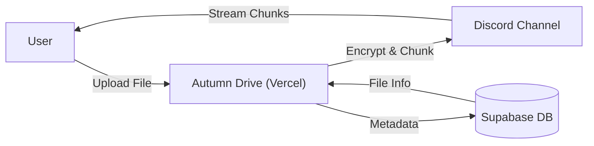

# Autumn Drive 🍂☁️

**Unlimited, Secure, and High-Speed Cloud Storage backed by Discord.**

Autumn Drive turns Discord's massive CDN into your personal, encrypted file system. It bypasses file size limits by smart-chunking, secures everything with AES-256, and runs entirely statelessly on Vercel.

## ✨ Key Features

-   **📂 Unlimited Storage**: Encrypted chunking logic stores file data on **Discord**.
- **⚡ High Performance**: Metadata stored in **Supabase (PostgreSQL)** for instant access.
- **🚀 Multi-User Scalability**: Optimized for concurrent use with request tracing and global rate-limit management.
- **☁️ Serverless**: Fully stateless backend, deployable on Vercel.
- **🔒 Zero-Knowledge**: Files are encrypted **before** they touch Discord. Only you have the key.
- **⚡ Super Fast**: Parallel uploads/downloads with **Dynamic Threading**.
- **📱 Premium UI**: Built with React, TailwindCSS, and a beautiful Catppuccin theme.
- **🖱️ Drag & Drop**: Seamlessly upload files by dropping them anywhere.
- **🛠️ Atomic Integrity**: Uses PostgreSQL Stored Procedures (RPC) to ensure files and chunks are saved as a single unit.

## ⚙️ How it Works

1.  **Store**: File metadata (name, size, keys) is stored securely in Supabase.
2.  **Upload**: You drop a file. It gets chunked, encrypted, and sent to Discord as messages.
3.  **Access**: The app instantly lists your files from Supabase and streams chunks from Discord on demand.

## 🚀 Deployment Guide (5 Minutes)

### 1. Create a Discord Bot
1.  Go to the [Discord Developer Portal](https://discord.com/developers/applications).
2.  Create a **New Application**.
3.  Go to **Bot** -> **Add Bot**.
4.  **Crucial**: Enable **Message Content Intent** under "Privileged Gateway Intents".
5.  Copy the **Token**.

### 2. Create a Channel
1.  Create a private server and a private channel.
2.  Right-click the channel -> **Copy Channel ID** (Enable Developer Mode if needed).
3.  Invite the Bot to your server.

### 3. Set up Supabase
1.  Go to **[Supabase](https://supabase.com)** and create a new project.
2.  Go to **SQL Editor** -> Paste the content of `schema.sql` (found in repo) -> **Run**. 
    *This creates the tables AND the atomic save function (`save_file_with_chunks`).*
3.  Go to **Settings** -> **API**. Copy `Project URL` and `service_role` (secret) key.

### 4. Deploy to Vercel
1.  Click the **Deploy** button above.
2.  Enter your Environment Variables:
    *   `DISCORD_BOT_TOKEN`: The token from step 1.
    *   `DISCORD_CHANNEL_ID`: The ID from step 2.
    *   `SUPABASE_URL`: From Supabase API Settings.
    *   `SUPABASE_KEY`: From Supabase API Settings (Service Role).
    *   `ENCRYPTION_KEY`: A random strong password (e.g., `correct-horse-battery-staple`).
    *   `ALLOWED_ORIGIN`: Your frontend URL (e.g., `https://your-app.vercel.app`).
    *   `DEBUG_LOGS`: Set to `true` to enable verbose server tracing (optional).
3.  Click **Deploy**. Done!

## 🛠️ Local Development

1.  **Clone**: `git clone https://github.com/yourusername/autumn-drive.git`
2.  **Install**: `npm run install:all`
3.  **Config**: Create `.env` (see `.env.example`).
4.  **Run**: `npm run dev` (Opens localhost:5173).

## 📄 License

MIT License. Educational Purpose Only.
**Disclaimer**: This project uses Discord in a way that may be against ToS for massive-scale storage. Use for personal, small-scale projects only.
